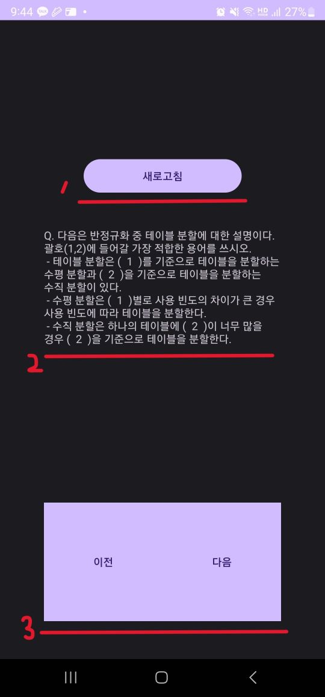

# 문제 복습 애플리케이션

- **개요**
    - 개인적으로 사용하기 위해 만든 정보처리기사 학습 모바일 애플리케이션입니다.
    PC 자판을 통해 간편하게 문제를 저장하고 스마트폰으로 복습하기 위해 만들게 되었습니다.
    
- **목표**
    - 웹사이트를 통한 문제 추가 기능
    - 모바일 애플리케이션을 통한 문제 복습
    
- **상세**
    - 문제 추가
        
        
        
        - 웹사이트에 접속하여 문제와 정답을 입력하여 제출합니다.
    - 복습
        
        
        
        1. 새로고침을 터치하여 서버의 문제 정보와 동기화합니다.
        2. 문제 터치하여 정답을 확인할 수 있습니다. 문제길이가 너무 긴 경우 스크롤하여 확인할 수 있습니다.
        3. 다음 또는 이전의 문제를 확인합니다.
    
- 사용 기술
    - Spring boot (Java)
    - Android (Kotlin)
    - Html
    - MySQL
    - AWS EC2
    - Docker
    - Nginx